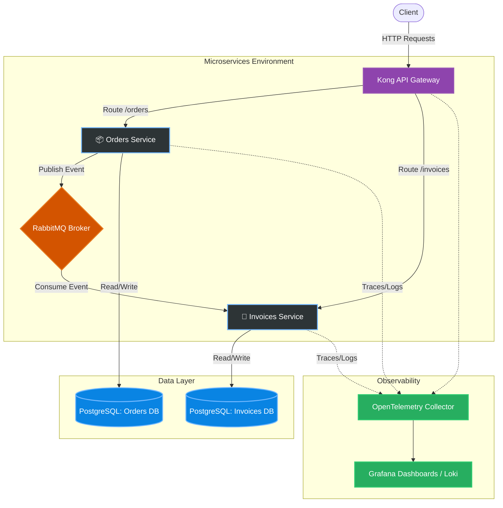

# 🧾 Orders & Invoices Microservices

[](https://opensource.org/licenses/MIT)
[](https://nodejs.org/)
[](https://fastify.dev/)
[](https://www.rabbitmq.com/)
[](https://www.postgresql.org/)
[](https://www.pulumi.com/)
[](https://aws.amazon.com/fargate/)

## 📖 Project Overview

This project implements a robust, distributed microservices architecture consisting of two independent domains: **Orders** and **Invoices**. The system is built with Node.js and Fastify, focusing on high performance, **eventual consistency**, and **asynchronous communication** via a message broker.

The architecture is explicitly designed to scale, ensuring data replication across domains and providing **full distributed observability** (traces, metrics, and structured logging) using the OpenTelemetry standard integrated with Grafana Loki. Deployment is fully automated using **Infrastructure as Code (IaC)** with Pulumi, targeting **AWS Fargate** for serverless container execution.

## ✨ Key Features

- **Asynchronous Messaging**: Event-driven communication using RabbitMQ to decouple services.
- **Database per Service**: Independent PostgreSQL schemas tailored to each domain's boundaries, avoiding tight coupling.
- **Eventual Consistency**: Ensuring data integrity across microservices without synchronous blocking calls.
- **Distributed Observability**: Deep tracing, metrics, and logs powered by OpenTelemetry, visualized in Grafana.
- **API Gateway**: Unified entry point and routing using Kong API Gateway.
- **Modern Node.js**: Utilizing Node.js v22 native features (`--experimental-strip-types`, native `.env` loading).
- **Serverless Deployments**: Automated AWS Fargate deployments via Pulumi.

---

## 🏗️ Architecture

Below is the high-level architecture diagram illustrating the request flow, asynchronous messaging, and observability pipelines.



---

## 🛠️ Technology Stack

| Category | Technology | Description |
| :--- | :--- | :--- |
| **Runtime** | **Node.js (v22)** | Application runtime using native TypeScript stripping. |
| **Framework** | **Fastify** | High-performance, low-overhead web framework. |
| **Validation** | **Zod** | Schema validation and type inference. |
| **Database ORM** | **Drizzle ORM** | Lightweight, type-safe SQL ORM for Node.js. |
| **Database** | **PostgreSQL** | Primary relational data store (Database-per-service). |
| **Message Broker** | **RabbitMQ** | Handles asynchronous event streaming between domains. |
| **Observability** | **OpenTelemetry & Grafana** | Distributed tracing, metrics gathering, and log aggregation. |
| **API Gateway** | **Kong** | Centralized routing and API management. |
| **Infrastructure** | **Pulumi & AWS Fargate** | Infrastructure as Code (IaC) and serverless container hosting. |

---

## 🚀 Getting Started

### Prerequisites

Ensure you have the following installed on your local machine:
- [Docker](https://www.docker.com/) & Docker Compose
- [Node.js v22+](https://nodejs.org/) (for local script execution and tooling)
- [Pulumi CLI](https://www.pulumi.com/docs/install/)
- Configured [AWS CLI](https://aws.amazon.com/cli/) with adequate permissions

### 🐳 Local Development (Docker Compose)

The easiest way to spin up the entire ecosystem (Databases, RabbitMQ, Observability stack, API Gateway, and Microservices) is via Docker Compose.

1. Clone the repository and navigate to the project directory:
   ```bash
   git clone git@github.com:patrick-cuppi/microservice-orders-invoices.git
   cd microservice-orders-invoices
   ```

2. Start the infrastructure and microservices:
   ```bash
   docker-compose up --build
   ```

3. The services will be exposed via the **Kong API Gateway** on `http://localhost:8000` (or the configured Kong port).
4. Access **Grafana** at `http://localhost:3000` to view distributed traces and logs.

### ☁️ AWS Deployment (Pulumi)

To deploy the infrastructure and services to AWS (using ECS Fargate, RDS, etc.):

1. Navigate to the infrastructure directory:
   ```bash
   cd infra
   ```

2. Initialize and deploy the stack:
   ```bash
   pulumi up
   ```

3. Review the execution plan generated by Pulumi and confirm the deployment.

---

## 📦 Project Structure

```text
/
├── .github/
│   └── workflows/          # CI/CD Pipelines
├── app-invoices/           # 🧾 Invoices Microservice Source Code
│   ├── src/                # Fastify, Drizzle, Handlers
│   ├── Dockerfile
│   └── package.json
├── app-orders/             # 📦 Orders Microservice Source Code
│   ├── src/                # Fastify, Drizzle, Handlers
│   ├── Dockerfile
│   └── package.json
├── contracts/
│   └── messages/           # Shared messaging schemas and types
├── docker/
│   └── kong/               # API Gateway configuration
├── infra/                  # ☁️ Infrastructure as Code (Pulumi)
├── docker-compose.yml      # Local development environment definitions
└── README.md
```

---

## 🔍 Observability

Observability is treated as a first-class citizen in this architecture. Both microservices are instrumented using `@opentelemetry/auto-instrumentations-node` and related SDKs.

- **Distributed Tracing**: Follow a single request as it passes through the Kong API Gateway, hits the Orders service, publishes a message to RabbitMQ, and is finally consumed by the Invoices service.
- **Structured Logging**: Application logs are enriched with Trace IDs and piped directly into Grafana Loki.
- **Dashboards**: Visualize real-time health, error rates, queue lengths, and latency inside Grafana.

---

## 🤝 Contributing

Contributions, issues, and feature requests are welcome! 
Feel free to check the [issues page](../../issues).

1. Fork the Project
2. Create your Feature Branch (`git checkout -b feature/AmazingFeature`)
3. Commit your Changes (`git commit -m 'Add some AmazingFeature'`)
4. Push to the Branch (`git push origin feature/AmazingFeature`)
5. Open a Pull Request

---

## 📄 License

This project is licensed under the **MIT License**. See the `LICENSE` file for details.